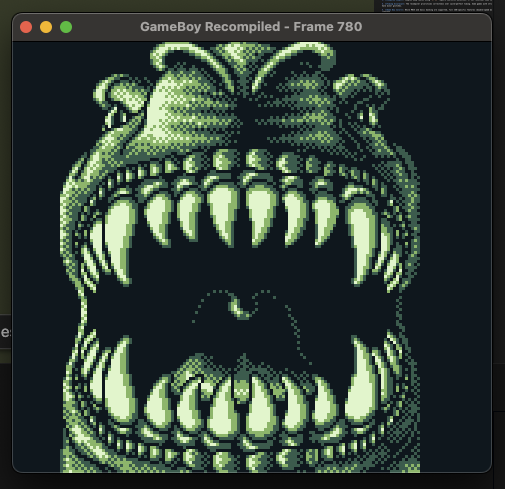

# GB Recompiled

A **static recompiler** for original GameBoy ROMs that translates Z80 assembly directly into portable, modern C code. Run your favorite classic games without a traditional emulator—just compile and play.


<p align="center">
  
</p>

---

## Downloads

Pre-built binaries are available on the [Releases](https://github.com/arcanite24/gb-recompiled/releases) page:

| Platform | Architecture | File |
|----------|--------------|------|
| **Windows** | x64 | `gb-recompiled-windows-x64.zip` |
| **Linux** | x64 | `gb-recompiled-linux-x64.tar.gz` |
| **macOS** | x64 (Intel) | `gb-recompiled-macos-x64.tar.gz` |
| **macOS** | ARM64 (Apple Silicon) | `gb-recompiled-macos-arm64.tar.gz` |

> **Note**: The recompiler (`gbrecomp`) is what you download. After recompiling a ROM, you'll still need CMake, Ninja, SDL2, and a C compiler to build the generated project.

---

## Features

- **High Compatibility**: Successfully recompiles **98.9%** of the tested ROM library (1592/1609 ROMs) **MOST OF THE GAMES ARE NOT FULLY PLAYABLE YET**
- **Native Performance**: Generated C code compiles to native machine code
- **Accurate Runtime**:
  - Cycle-accurate instruction emulation (including HALT bug)
  - Precise OAM DMA and interrupt timing
  - Accurate PPU (graphics) emulation with scanline rendering
  - Audio subsystem (APU) with all 4 channels
- **Memory Bank Controllers**: Full support for MBC1 (including Mode 1), MBC2, MBC3 (with RTC), and MBC5
- **SDL2 Platform Layer**: Ready-to-run with keyboard/controller input and window display
- **Debugging Tools**: Trace logging, instruction limits, and screenshot capture
- **Cross-Platform**: Works on macOS, Linux, and Windows (via CMake + Ninja)

---

## Quick Start

### Prerequisites

- **CMake** 3.15+
- **Ninja** build system
- **SDL2** development libraries
- A C/C++ compiler (Clang, GCC, or MSVC)

### Building

```bash
# Clone and enter the repository
git clone https://github.com/yourname/gb-recompiled.git
cd gb-recompiled

# Configure and build
cmake -G Ninja -B build .
ninja -C build
```

### Recompiling a ROM

```bash
# Generate C code from a ROM
./build/bin/gbrecomp path/to/game.gb -o output/game

# Build the generated project
cmake -G Ninja -S output/game -B output/game/build
ninja -C output/game/build

# Run!
./output/game/build/game
```

---

## Usage

### Basic Recompilation

```bash
./build/bin/gbrecomp <rom.gb> -o <output_dir>
```

The recompiler will:
1. Load and parse the ROM header
2. Analyze control flow across all memory banks
3. Decode instructions and track bank switches
4. Generate C source files with the runtime library

### Debugging Options

| Flag | Description |
|------|-------------|
| `--trace` | Print every instruction during analysis |
| `--limit <N>` | Stop analysis after N instructions |
| `--add-entry-point b:addr` | Manually specified entry point (e.g. `1:4000`) |
| `--no-scan` | Disable aggressive code scanning (enabled by default) |
| `--verbose` | Show detailed analysis statistics |
| `--use-trace <file>` | Use runtime trace to seed entry points |

**Example:**
```bash
# Debug a problematic ROM
./build/bin/gbrecomp game.gb -o output/game --trace --limit 5000
```

### Advanced Usage

**Trace-Guided Recompilation (Recommended):**
Complex games (like *Pokémon Blue*) often use computed jumps that static analysis cannot resolve. You can use execution traces to "seed" the analyzer with every instruction physically executed during a real emulated session.

1. **Generate a trace**: Run any recompiled version of the game with tracing enabled, or use the **[Ground Truth Capture Tool](GROUND_TRUTH_WORKFLOW.md)** with PyBoy.
   ```bash
   # Option A: Using recompiled game
   ./output/game/build/game --trace-entries game.trace --limit 1000000

   # Option B: Using PyBoy "Ground Truth" Capture (Recommended for new games)
   python3 tools/capture_ground_truth.py roms/game.gb -o game.trace --random
   ```
2. **Recompile with grounding**: Feed the trace back into the recompiler.
   ```bash
   ./build/bin/gbrecomp roms/game.gb -o output/game --use-trace game.trace
   ```

For a detailed walkthrough, see **[GROUND_TRUTH_WORKFLOW.md](GROUND_TRUTH_WORKFLOW.md)**.
**Generic Indirect Jump Solver:**
The recompiler includes an advanced static solver for `JP HL` and `CALL HL` instructions. It tracks the contents of all 8-bit registers and 16-bit pairs throughout the program's control flow. 

- **Register Tracking**: Accurately handles constant pointers loaded into `HL` or table bases loaded into `DE`.
- **Table Backtracking**: When a `JP HL` is encountered with an unknown `HL`, the recompiler scans back for jump table patterns (e.g., page-aligned pointers) and automatically discovers all potential branch targets.
- **Impact**: Provides >98% code discovery for complex RPGs like *Pokémon* without requiring dynamic traces.

**Manual Entry Points:**
If you see `[GB] Interpreter` messages in the logs at specific addresses, you can manually force the recompiler to analyze them:
```bash
./build/bin/gbrecomp roms/game.gb -o out_dir --add-entry-point 28:602B
```

**Aggressive Scanning:**
The recompiler automatically scans memory banks for code that isn't directly reachable (e.g. unreferenced functions). This improves compatibility but may occasionally misidentify data as code. To disable it:
```bash
./build/bin/gbrecomp roms/game.gb -o out_dir --no-scan
```

### Runtime Options

When running a recompiled game:

| Option | Description |
|--------|-------------|
| `--input <script>` | Automate input from a script file |
| `--dump-frames <list>` | Dump specific frames as screenshots |
| `--screenshot-prefix <path>` | Set screenshot output path |
| `--trace-entries <file>` | Log all executed (Bank, PC) points to file |

### Controls

| GameBoy | Keyboard (Primary) | Keyboard (Alt) |
|---------|-------------------|----------------|
| **D-Pad Up** | ↑ Arrow | W |
| **D-Pad Down** | ↓ Arrow | S |
| **D-Pad Left** | ← Arrow | A |
| **D-Pad Right** | → Arrow | D |
| **A Button** | Z | J |
| **B Button** | X | K |
| **Start** | Enter | - |
| **Select** | Right Shift | Backspace |
| **Quit** | Escape | - |

---

## How It Works

### 1. Analysis Phase
The recompiler performs static control flow analysis:
- Discovers all reachable code starting from entry points (`0x100`, interrupt vectors)
- Tracks bank switches to follow cross-bank calls and jumps
- Detects computed jumps (e.g., `JP HL`) and resolves jump tables
- Separates code from data using heuristics

### 2. Code Generation
Instructions are translated to C:
```c
// Original: LD A, [HL+]
ctx->a = gb_read8(ctx, ctx->hl++);

// Original: ADD A, B
gb_add8(ctx, ctx->b);

// Original: JP NZ, 0x1234
if (!ctx->flag_z) { func_00_1234(ctx); return; }
```

Each ROM bank becomes a separate C file with functions for reachable code blocks.

### 3. Runtime Execution
The generated code links against `libgbrt`, which provides:
- Memory-mapped I/O (`gb_read8`, `gb_write8`)
- CPU flag manipulation
- PPU scanline rendering
- Audio sample generation
- Timer and interrupt handling

---

## Compatibility

See [COMPATIBILITY.md](COMPATIBILITY.md) for the full test report.
Recompilation doesn't mean fully playable. Most of the games are not fully playable yet and some are not even playable.

| Status | Count | Percentage |
|--------|-------|------------|
| ✅ SUCCESS | 1592 | 98.94% |
| ❌ RECOMPILE_FAIL | 1 | 0.06% |
| ⚠️ RUN_TIMEOUT | 1 | 0.06% |
| 🔧 EXCEPTION | 7 | 0.44% |

Manually confirmed working examples:
- **Tetris (Japan) (En)** (md5: 084f1e457749cdec86183189bd88ce69)
  - Title screen sometimes glitches
  - After completing a line, you need to pause and resume to fix the graphics
  - Audio glitches

---

## Project Status & Roadmap

### Current Limitations
1. **RAM Execution**: Code that runs from RAM (e.g., self-modifying code in `cpu_instrs.gb`) cannot be statically recompiled yet.
2. **Computed Jumps**: Complex jump tables using `JP HL` (like switch statements) require better heuristic detection.
3. **Audio**: Some channel quirks and "zombie mode" envelope glitches are not yet implemented.

### Missing Features (Roadmap)
The following features are prioritized for future updates:

#### Game Boy Color (CGB)
- [ ] **Double Speed Mode**: CPU speed switching.
- [ ] **Memory Banking**: VRAM (16KB) and WRAM (32KB) banking support.
- [ ] **CGB Palettes**: Support for 0xFF68-0xFF6B registers.
- [ ] **DMA**: HDMA and GDMA transfer implementation.

#### Accuracy & Enhancements
- [ ] **PPU Timing**: Variable Mode 3 length for perfect pixel timing.
- [ ] **Recompiler**: Improved detection for switch-statement-style jump tables.
- [ ] **Self-Modifying Code**: Detection and interpreter fallback for RAM-executed code.

#### Misc
- [x] Tools to identify entry-points (Trace-Guided Analysis)
- [ ] Tools for better graphical debugging (outputting PNGs grid instead of raw PPMs)

---

## Tools

The `tools/` directory contains utilities for analysis and verification:

### 1. Ground Truth Capturer
Automate instruction discovery using a high-speed headless emulator (**PyBoy** recommended).
```bash
python3 tools/capture_ground_truth.py roms/game.gb --frames 3600 --random -o game.trace
```

### 2. Coverage Analyzer
Audit your recompiled code against a dynamic trace to see exactly what instructions are missing.
```bash
python3 tools/compare_ground_truth.py --trace game.trace output/game
```

---

## Development

### Project Architecture

The recompiler uses a multi-stage pipeline:

```
ROM → Decoder → IR Builder → Analyzer → C Emitter → Output
         ↓           ↓            ↓
     Opcodes   Intermediate   Control Flow
               Representation   Graph
```

Key components:
- **Decoder** (`decoder.h`): Parses raw bytes into structured opcodes
- **IR Builder** (`ir_builder.h`): Converts opcodes to intermediate representation
- **Analyzer** (`analyzer.h`): Builds control flow graph and tracks bank switches
- **C Emitter** (`c_emitter.h`): Generates C code from IR

---

## License

This project is licensed under the MIT License.

**Note**: GameBoy is a trademark of Nintendo. This project does not include any copyrighted ROM data. You must provide your own legally obtained ROM files.

---

## Acknowledgments

- [Pan Docs](https://gbdev.io/pandocs/) - The definitive GameBoy technical reference
- [mgbdis](https://github.com/mattcurrie/mgbdis) - GameBoy disassembler (included in tools/)
- The gbdev community for extensive documentation and test ROMs
- [N64Recomp](https://github.com/Mr-Wiseguy/N64Recomp) - The original recompiler that inspired this project

---

## Contributing

Contributions are welcome! Please open an issue first to discuss major changes.

Areas of interest:
- Game Boy Color support improvements
- Audio accuracy enhancements
- Performance optimizations
- Debugging tools
- Improve compatibility with more ROMs